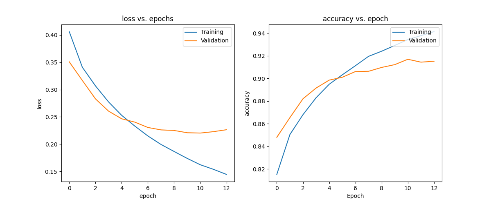

# Gender Prediction Model based on First Name
This prediction model is created based on character level LSTM model built using `tensorflow` with `python3.8`.

- [Simple EDA done on raw data](https://github.com/jamesnzeex/gender_prediction/blob/main/EDA.ipynb)
<p align = "center">
    
</p>

## Deployment
To set up the script, clone the repo and install the requirements. 
```
# clone repository
git clone https://github.com/jamesnzeex/gender_prediction.git

# change to project repository
cd gender_prediction

# install requirements
pip install -r requirements.txt

# to predict gender given first name of person
python serve.py -n "Alan" "Bobby" "Celine"
Output:
{"Alan":"Male","Bobby":"Male","Celine":"Female"}

# via flask API, send curl via terminal/postman
python serve.py -d
curl -X POST -d '{"name": ["Alan", "Bobby", "Celine"]}' http://127.0.0.1:5000/ -H 'Content-Type:application/json'
Output:
{"Alan":"Male","Bobby":"Male","Celine":"Female"}

# to retrain model
python serve.py -r
```

Refer to [here](https://huggingface.co/spaces/jamesnzeex/gender_prediction) for demo of the script in action
